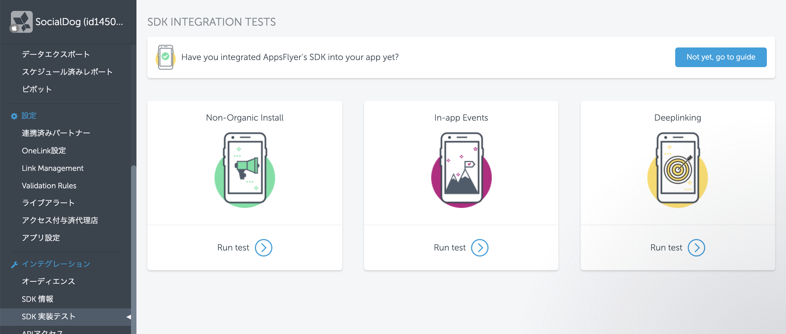
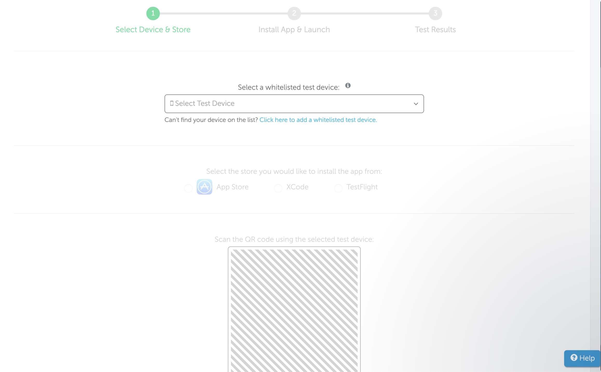
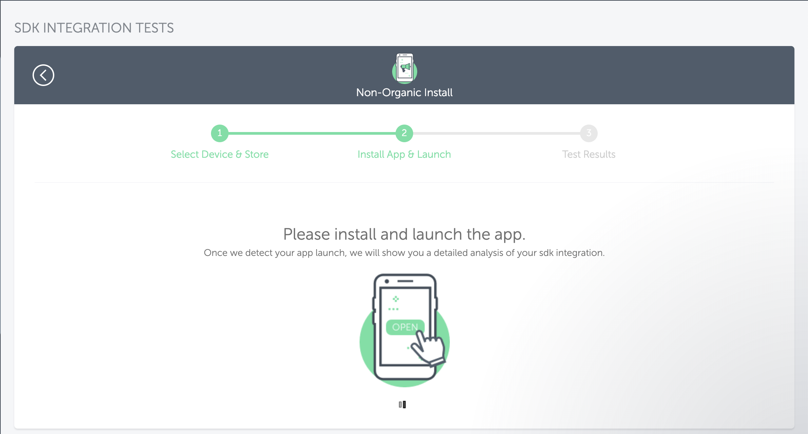
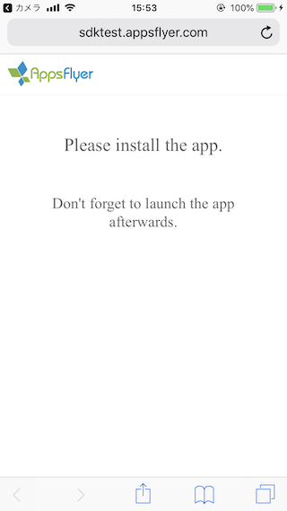
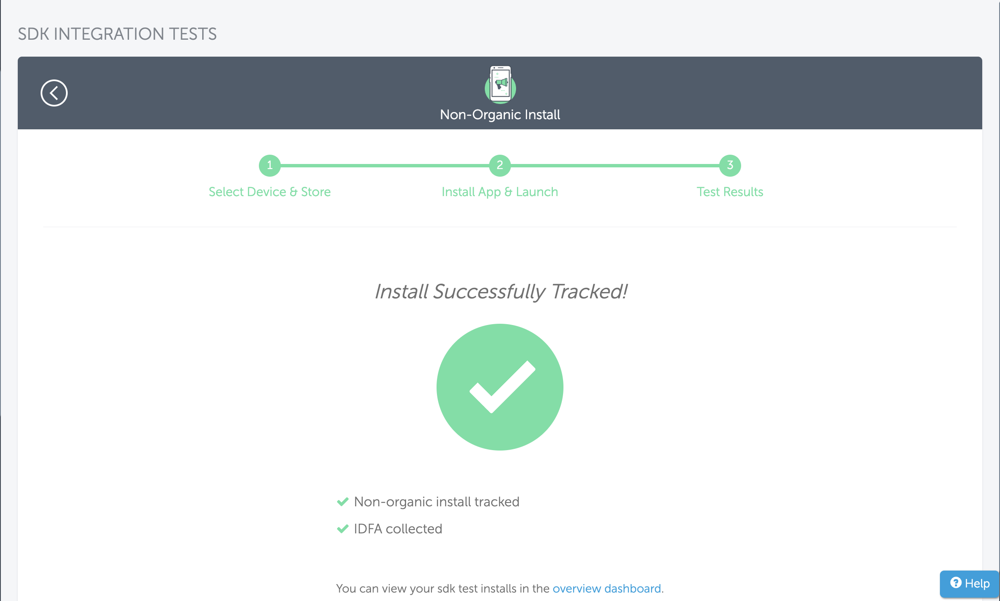
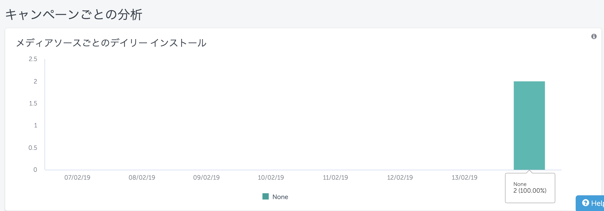

## ios

react-native用package  
[AppsFlyerSDK/react-native-appsflyer](https://github.com/AppsFlyerSDK/react-native-appsflyer)

README.mdのままyarn add react-native-appsflyer  
PodFileにreact-native-appsflyerを追加してインストールする。

[‎My Device ID by AppsFlyer/itunes.apple.com](https://itunes.apple.com/us/app/my-device-id-by-appsflyer-whitelist-test-device/id1192323960?ls=1&mt=8)  
をインストールして端末をホワイトリスト化する。(公式のQRコードリンク切れてる...)

[iOS SDK実装・計測テスト方法 - Testing iOS SDK Integration](https://support.appsflyer.com/hc/ja/articles/115000262823-iOS-SDK%E5%AE%9F%E8%A3%85-%E8%A8%88%E6%B8%AC%E3%83%86%E3%82%B9%E3%83%88%E6%96%B9%E6%B3%95-Testing-iOS-SDK-Integration)



追加したホワイトリスト端末を選択しXCodeを選択,QRコードを実機スマホで取る


### PC

### SP



iphone上でこの画面の状態からアプリをXcodeでビルドしてインストールする。
インストールして１分ぐらい待つとAppsFlyer側の画面がSuccessに切り替わるはず。
(もしかしたら作成した直後調子悪かったりするかも？何回か試していると成功した)



オーバービューの`appsflyer_sdk_test_init`インストール数が増えているので完了



## Android
ReactNativeのiosにAppsFlyerを導入する。  
iosと比べて確認方法が楽で説明も充実しているのでこれ参考で終わるはず。

[AppsFlyer Android SDK実装テスト](https://support.appsflyer.com/hc/ja/articles/210213753-AppsFlyer-Android-SDK%E5%AE%9F%E8%A3%85%E3%83%86%E3%82%B9%E3%83%88)

と思ったがの警告で
```js
AppsFlyer broadcastReceiver wasn't found in the android manifeset you may continue withuout the broadcastreceiver configured but the test will only pass if the app has never been opened and the device is whiteliested do you wish to continue with testing ?
```

`Manifest Receiver（Optional)`でError

`MainApplication.xml`へPermissionとreceiverを追加して再ビルドでSuccess。
```xml
    <uses-permission android:name="android.permission.ACCESS_NETWORK_STATE" />
    <uses-permission android:name="android.permission.ACCESS_WIFI_STATE" />
    <uses-permission android:name="android.permission.READ_PHONE_STATE" />
```

```xml
<application>
  ...
  <receiver android:name="com.appsflyer.SingleInstallBroadcastReceiver" android:exported="true">
      <intent-filter>
          <action android:name="com.android.vending.INSTALL_REFERRER" />
      </intent-filter>
  </receiver>
  ...
</application>
```


## その他

iosをメインでandroidを久々に触ると下記の様な古いアプリがあるエラーでインストール出来ないとか初歩的なので毎回あっ・・・ってなる・・・
```sh
INSTALL_FAILED_UPDATE_INCOMPATIBLE: Package jp.autoscale.socialdog signatures do not match the previously installed version; ignoring!
```


