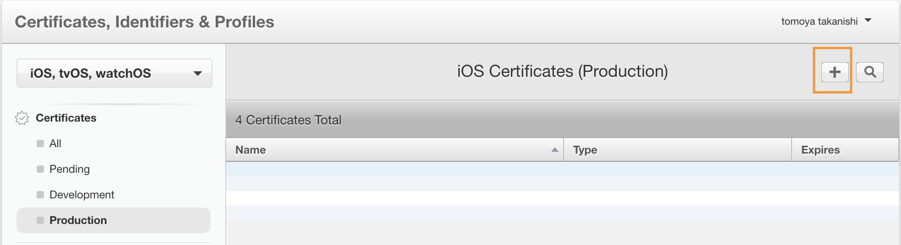
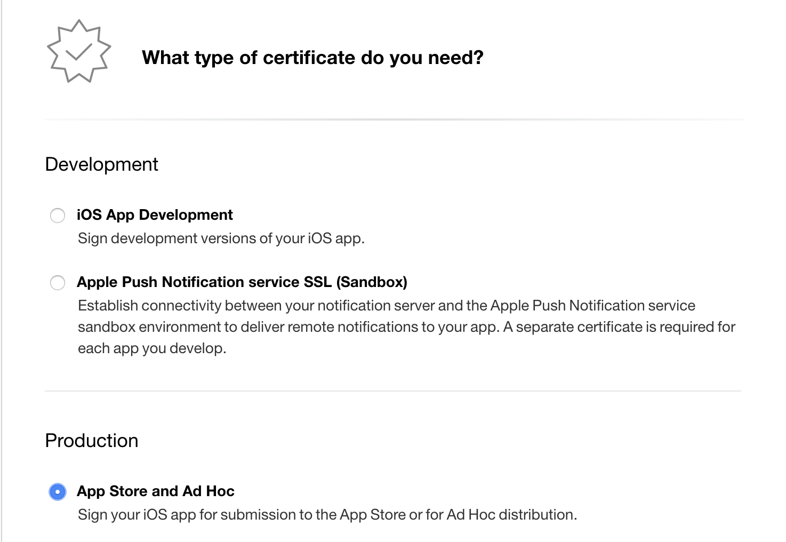
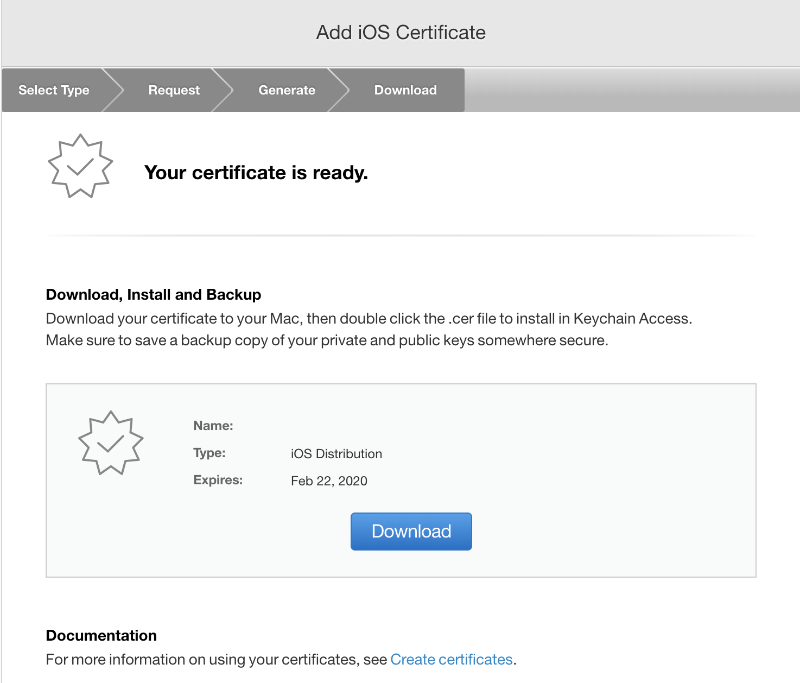
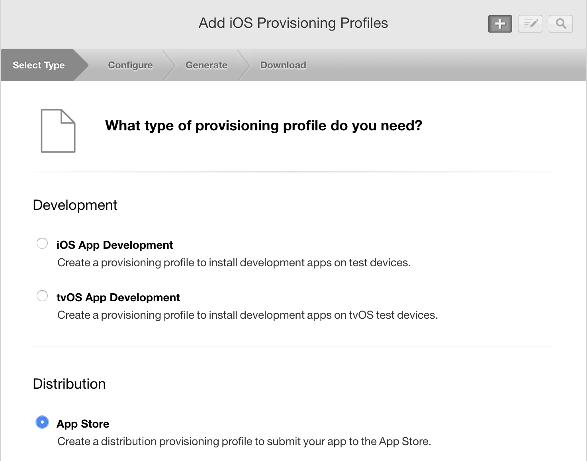
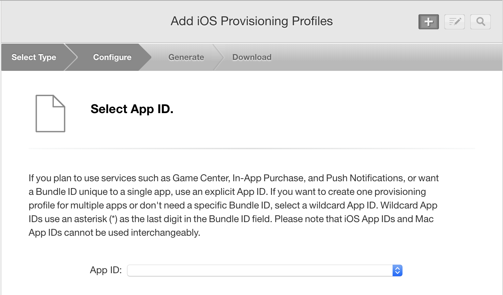
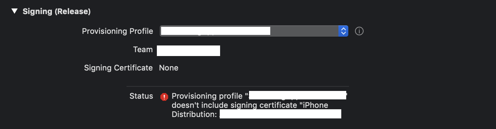
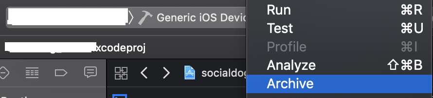

## 手順

作業しながらの殴り書き。  
Archive実行するまで。  
AppIDはアプリを実機ビルドする際に作っている物とする。

AppleDeveloperから  
`Certificates, Identifiers & Profiles`の＋ボタンを押す

証明書のタイプが聞かれるので`App Store and Ad Hoc`を選択

作成されるので`ios_distribution.cer`をダウンロード

`IosProviningProfiles`へ飛び＋ボタンを押す

ProvisioningProfileのタイプを聞かれるのでAppStoreを選択

使用するAppIDを選択する

作成されるので`AppName.mobileprovision`ダウンロードする。

これで`ios_distribution.cer`と`AppName.mobileprovision`が手に入るはず。

### Xcode

ProvisoningFileを変更したものに変更する  
ここでうまくいかない場合は  
- 個人開発の証明書を消す
- 入れた証明書が期限切れになっていないかなっていたら消して入れ直す。
- 自分の証明書にiPhone Distributionが入っていないか？

とかした。

  

ビルド先を`Generic iOS Device`に変更してから

Archiveする。

