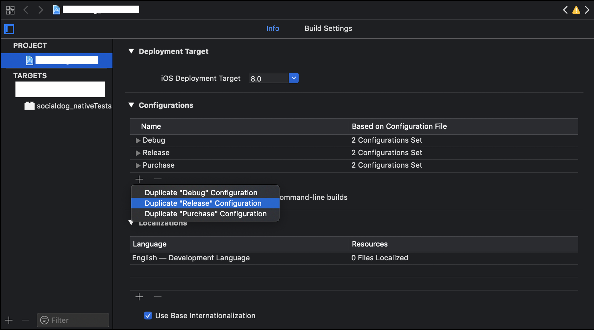
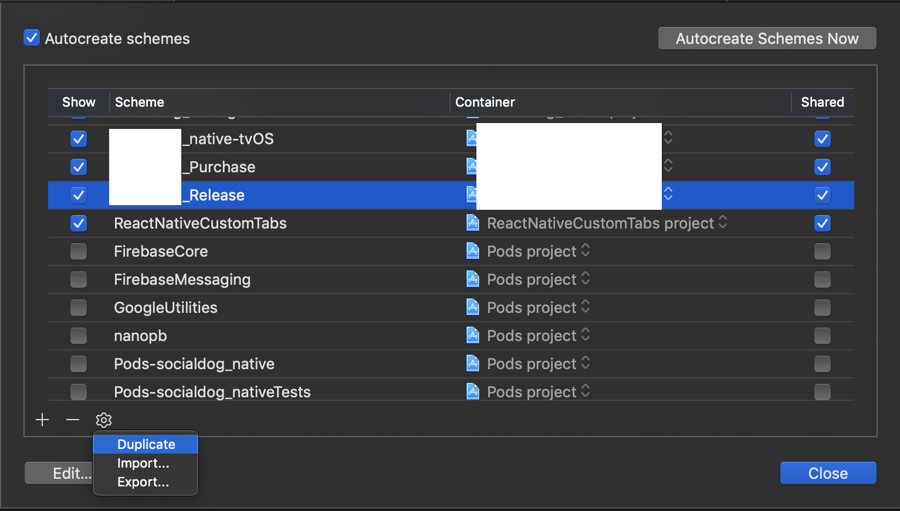
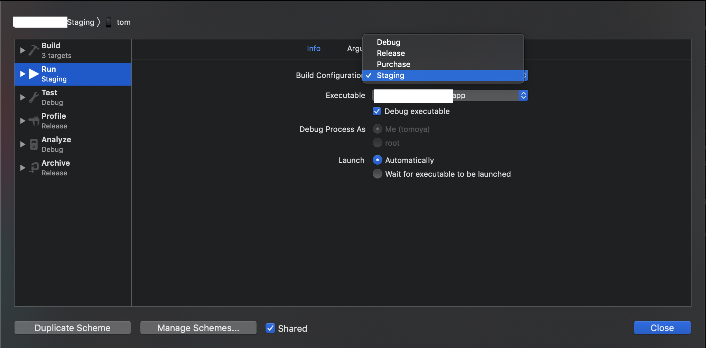
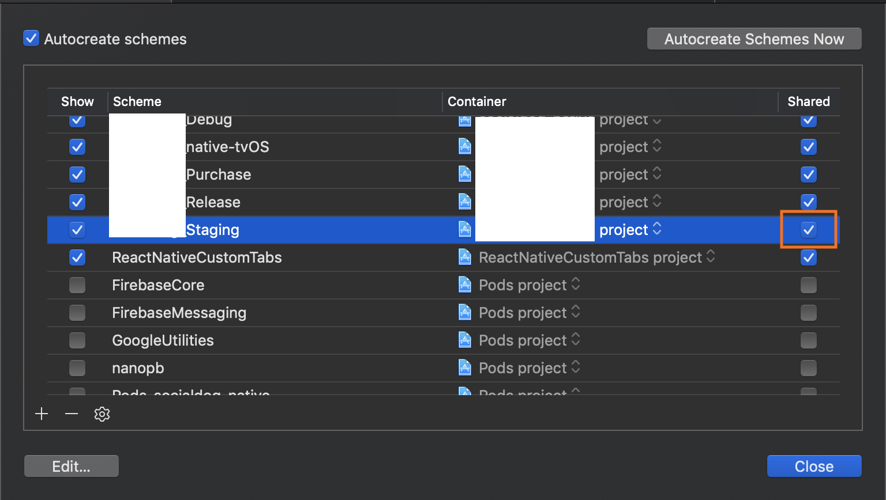
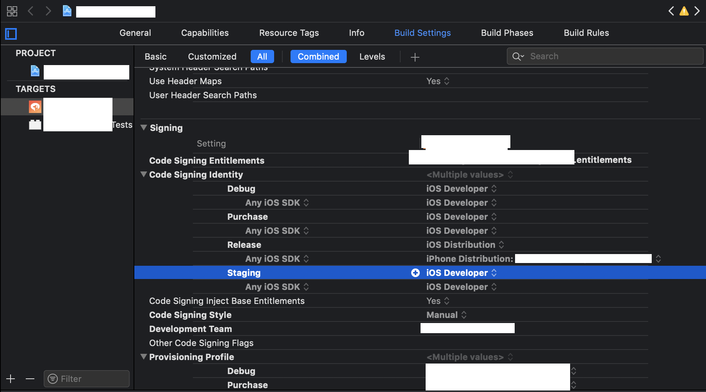
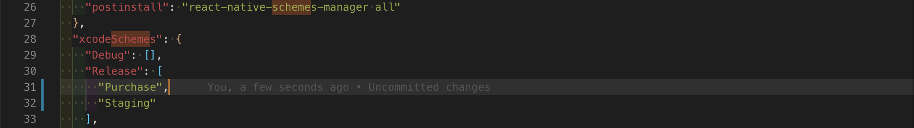

ProjectからConfigurationsで  
Duplicate Relase ConfigurationからReleaseBuildを選択する。



Edit SchemeからコピーしたいSchemeを選びDuplicate



RunのBuildConfigurationを`Statging`に変える



編集後はEdit Scheme上でSharedにチェックを入れておく


Schemeによって変えたい箇所を修正する。



[thekevinbrown/react-native-schemes-manager](https://github.com/thekevinbrown/react-native-schemes-manager)
をREADME通りに導入する。

```sh
$ yarn add --dev react-native-schemes-manager
```

package.jsonのpostinstallにコピーしたいSchemeを追加しyarnを走らせると自動で設定周りがコピーされていく。



CircleCIなどでこのコピー処理がエラーを吐くと思うので  
ciでのyarn installは`yarn install --ignore-scripts`でpost-installを無効にする。

