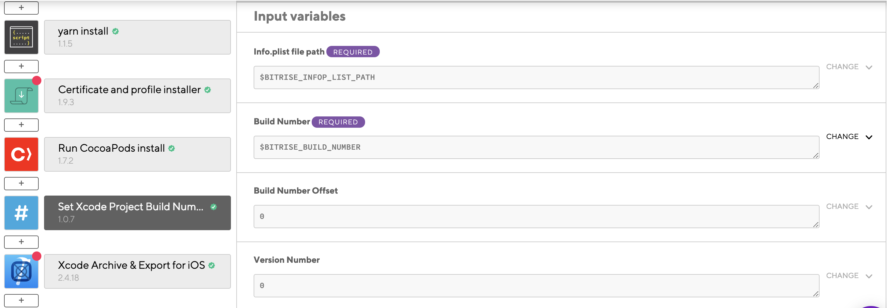
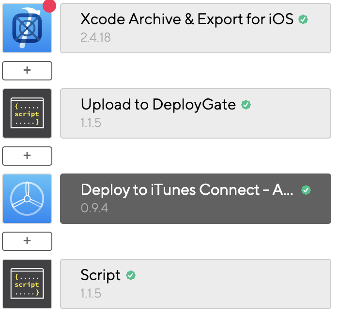

## ios

BitriseにRelease用の`.p12`と`.mobileprovision`を上げるために  
[bitrise-tools/codesigndoc](https://github.com/bitrise-tools/codesigndoc)  
を使用する。

`project/ios`で  
`bash -l -c "$(curl -sfL https://raw.githubusercontent.com/bitrise-tools/codesigndoc/master/_scripts/install_wrap-xcode.sh)"`  
を実行し
抜き出すSchemeを決めて.....を10分ぐらい待った後に質問に答えていき、  
BitriseのAccessTokenを取得しターミナルに貼り付けると  
自動的にBitriseに`.p12`と`.mobileprovision`をアップロードしてくれる。

BitriseのWorkflowに移動し  
SetXcodeProjectBuildNumberをフローに追加  
ワークフローのテスト中は0を指定して  
それ以外は中身を空にしてBitriseのBuildNumberが自動で入るのでそのままにしてある。

Deploy to iTunes Connectをフローに追加  

- 開発者のAppleID/PWをSecretで追加
- 2段階認証のアカウントの場合はApplication Specific Password をAppleIDWebSiteで作成しSecretで追加

[Apple ID](https://appleid.apple.com/#!&page=signin)

でアップロードが終わって  
５分ぐらいでAppStoreConnectに上がったメールが来るので終わり。