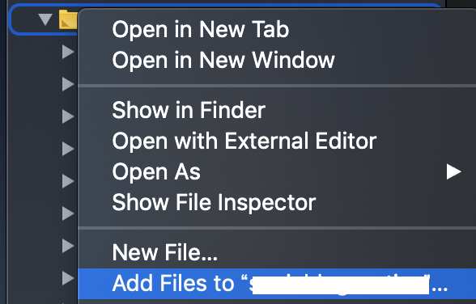
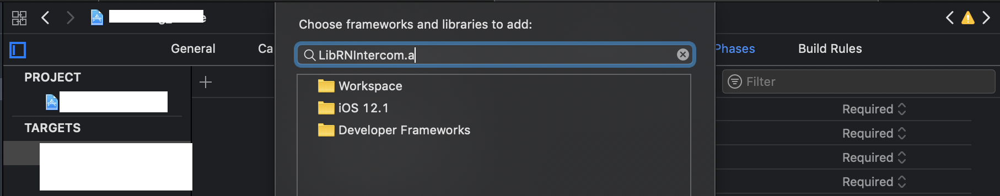

## iOS

[Installing Intercom](https://developers.intercom.com/installing-intercom/docs/ios-installation)

Podfileに

```sh
pod 'Intercom'
```

で

```sh
$ pod install
$ yarn react-native-intercom
$ yarn react-native link react-native-intercom
```

Appdelegate.mに
```objc
// 上部に
#import "Intercom/intercom.h"

- (void)application:(UIApplication *)application didRegisterForRemoteNotificationsWithDeviceToken:(NSData *)deviceToken {

    // Intercom
    [Intercom setDeviceToken:deviceToken];

}

```


login後とかに
```js
import Intercom from 'react-native-intercom';
Intercom.registerIdentifiedUser({ userId: 'Bob' });
```

お問い合わせチャット表示
```js
Intercom.displayMessageComposer();
```

でBuildするも
```sh
Error: Cannot read property 'UNREAD_CHANGE_NOTIFICATION' of undefined
```
で落ちる

ので

[Build error "cannot read property unread change notification of undefined" · Issue #174 · tinycreative/react-native-intercom · GitHub](https://github.com/tinycreative/react-native-intercom/issues/174#issuecomment-367956506)

select Add File to Project Name -> located in node_modules/react-native-intercom/iOS/RNIntercom.xcodeproj

General Settings -> Build Phases -> Link Binary with Libraries で libRNIntercom.a を追加する。



## Android

README通りに入れていくが

[Android build error: No resource identifier found for attribute 'appComponentFactory' in package 'android' · Issue #243 · tinycreative/react-native-intercom · GitHub](https://github.com/tinycreative/react-native-intercom/issues/243)
```sh
Android build error: No resource identifier found for attribute 'appComponentFactory' in package 'android' 
```
で怒られる
[Build failed with intercom-android v5.1.6 · Issue #238 · tinycreative/react-native-intercom · GitHub](https://github.com/tinycreative/react-native-intercom/issues/238#issuecomment-438968593)
このコメントどおり下記を入れてSDK28に対応していないパッケージを使うことで回避する。


```java
subprojects {
    afterEvaluate {project ->
        if (project.hasProperty("android")) {
            configurations.all {
                resolutionStrategy.force 'io.intercom.android:intercom-sdk-base:5.1.5'
            }
        }
    }
}
```


## 起動したがAndroidで反応してくれない

チャット画面を開いても何故かチャットが表示されずリトライ表示になる
issue見た感じuserIdがセットされていないとリトライ画面になる様だったので

```js
  Intercom.registerIdentifiedUser({ userId: 1234 })
```

上記でios動いていたのだがでエラーを表示してみる

```js
await Intercom.registerIdentifiedUser({ userId: 1234 }).catch(e =>
  console.log(e)
);
```

と

```sh
[Error: java.lang.ClassCastException: Value for userId cannot be cast from Double to String] framesToPop: 1, code: 'EUNSPECIFIED'
```

でエラーuserIdをStringにして修正。


ios/android両方共起動してuserIdが認識され無事接続されると

おめでとうございます。
Intercomに接続されました。

的な文言(一瞬でスクショ忘れた)が初回起動時にモーダルで表示されるのでその状態で
お問い合わせを開くとしっかりチャットできる。

終わり。


gradle周りは雰囲気でやってるのでしっかりやりたいな。。。

