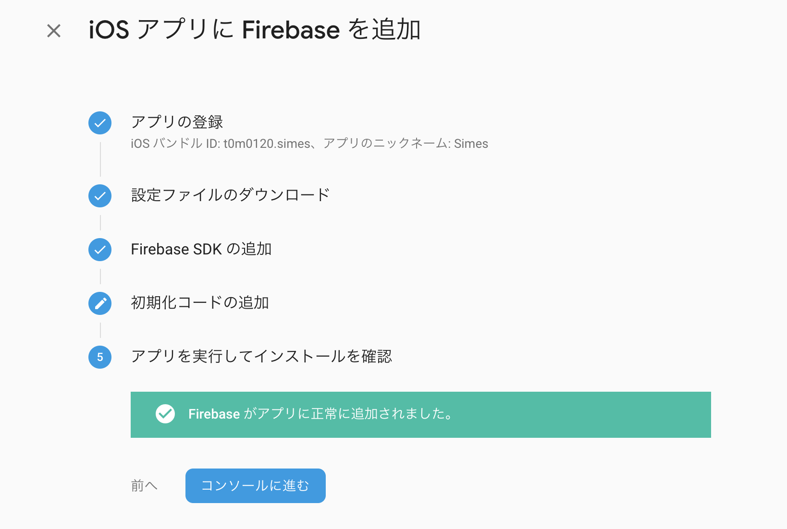

夕方から目白駅向かいの宮越屋珈琲に引きこもっていた。  
期間限定のモカハラー~~1杯1000円で~~旨すぎるし電源Wifi完備に客層も静かで良かった。

## 進捗
- Component作り
- Firebase
- TwitterLogin途中

## Firebaseを入れる  

[initial-setup](https://rnfirebase.io/docs/v5.x.x/installation/initial-setup)  
公式Doc通りにやればすぐに入る。  


## ios/android共通

`yarn add react-native-firebase`  
`react-native link react-native-firebase`  


## iOS

FirebaseコンソールからのiOS追加に従い  
`GoogleService-Info.plist`をXcodeからプロジェクトに追加  

`project/ios`ディレクトリで`$ pod init`して  
生成されるPodFileに  
```pod
  pod 'Firebase/Core'
```  
を追加して`$pod install`  
`.gitignore`に`ios/Pods`を追加しておく  


`Appdelegate.m`に

```objc
  #import <Firebase.h>
```

と`didFinishLaunchingWithOptions:(NSDictionary *)launchOptions`の最初に
```objc
  [FIRApp configure];
```

を追加。

追加後一旦アプリをアンインストールしてから  
`$react-native run-ios`  
して待つと下記画面でFirebase側に認識されるので終わり。



## Android

ほぼ同じ

FirebaseConsoleに従って
`google-services.json`をDLして  
`android/app/google-services.json`を入れる

ただFirebase側に従うとfirebase周りのverでコンフリクトするっぽいので
Firebaseの[AndroidREADME](https://rnfirebase.io/docs/v5.x.x/installation/android)に従って`build.gradle`にfirebaseを入れていく。


## TwitterLogin

[Firebase/Social Auth](https://rnfirebase.io/docs/v5.x.x/auth/social-auth#Twitter)見た感じ
[react-native-twitter-signin](https://github.com/GoldenOwlAsia/react-native-twitter-signin/issues/117#issuecomment-447859381)と組み合わせて使うっぽいが
twitter-signinが簡単には無理そうなので諦めるかも。

[Errors like: Class TWTRScribeService is implemented in both ... #18](https://github.com/twitter/twitter-kit-ios/issues/18)