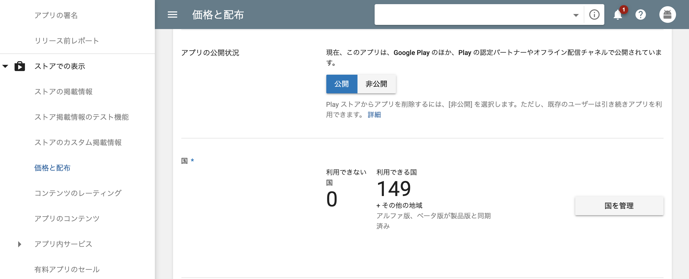

2年前に~~クソ苦戦しながら~~リリース作業した時に比べて、GooglePlayConsole滅茶苦茶見やすいし機能も増えていて使いやすさに驚いた。
というか審査も数分だった気がするけどテストか何か走らせてるのか30分ぐらいかかるようになって焦った。  

リリース作業が面倒な事がわかっているiOSより苦戦したかもしれない...

## 本題

もし初回に上げて公開してしまったパッケージにバグがあったりした場合  
GooglePlayConsoleの  
`ストアでの表示 > 価格と配布 > アプリの公開状況`  
を非公開にすればPlayStoreから消えます。

幻のv1.5.2は無いし現場からは以上です。