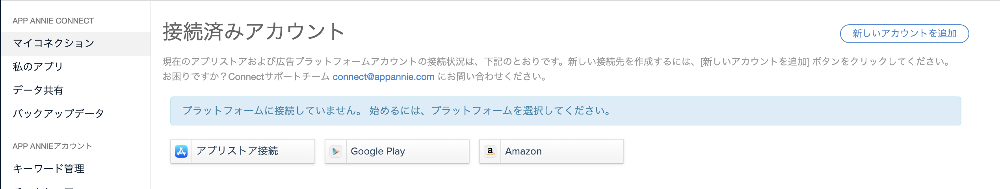
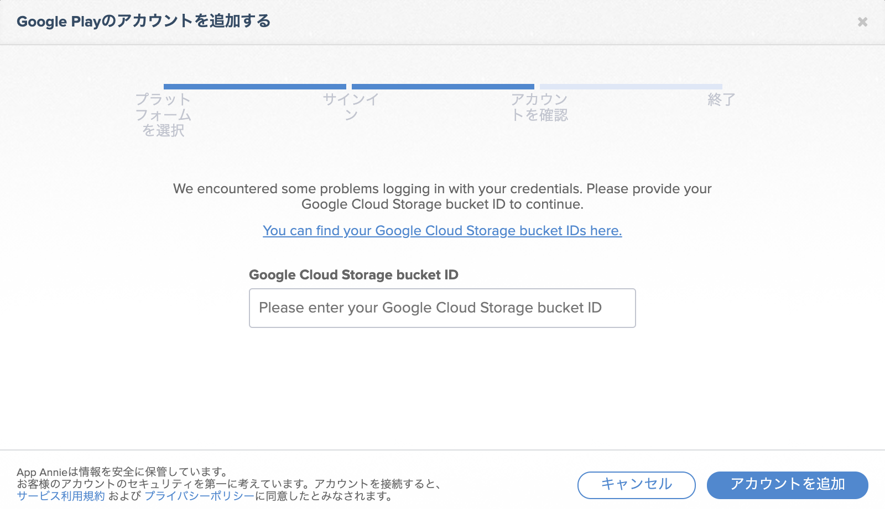
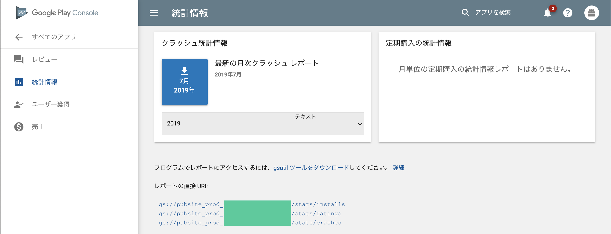
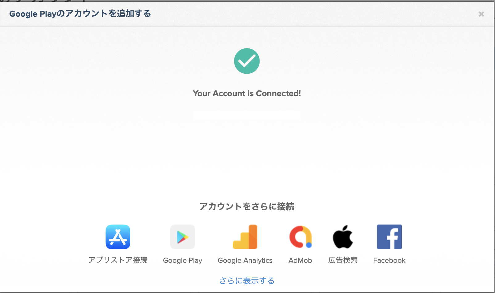

AppAnnieへのPlayConsoleの追加方法で少し手間取ったのでメモ

1. AppAnnieのマイコネクションからPlayConsoleを選択

2. 指示通りID/PWと2段階認証をこなす
なぜか失敗してcloud storageのidが求められるが  
これが何か分からりにくかった。

3. PlayConsoleからすべてのレポート > 統計情報へ飛ぶ  
最下部に`pubsite_prod_1111111111111`の記載があるのでこの数字を上のID欄へ打ち込む

アクセス成功画面が出て終了

結局ID/PW打って失敗するしAppAnnieとPlayConsoleの権限強めてもらったアカウントでも駄目で  
結局管理者のアカウントでやって成功したのでよくわかってない...