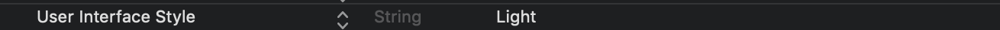

9月10日あたりにiOS13くるっぽく 
[iOS 13 beta, release date and feature list](https://www.techradar.com/news/ios-13-features) 

[iOS 13における必須対応について](https://techracho.bpsinc.jp/yoshi-k/2019_08_28/79514)など色々記事出始めてきているので

Xcode beta インストールして 自社のアプリのテストを行ってみた。

[https://developer.apple.com/download/](https://developer.apple.com/download/)から 
Xcode 11 beta 7をインストール。 
既存のXcodeとは別にインストールされBetaのタグがつくので開発環境が壊れることはない（はず。）

XcodeBetaのシミュレーターはすべてiOS13が入っているのでReactNativeをBuildしてインストールしてみる。

- 基本動作
- 画像投稿などのNativeな機能
- ダークモード無効化

を試してみたが特に問題なく動いていそうなのでiOS13で別途対応必要そうなものは無さそうか？？？

## ダークモードのテスト

info.plistから`User Interface Style`を`Ligth`にして

シミュレーターを再起動するとダークモードの状態でもライトモードで表示されるのが確認できた。

|  変更前  |  変更後  |
| ---- | ---- |
|  |  |

